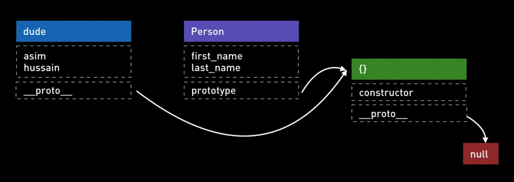
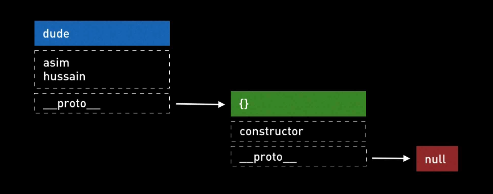
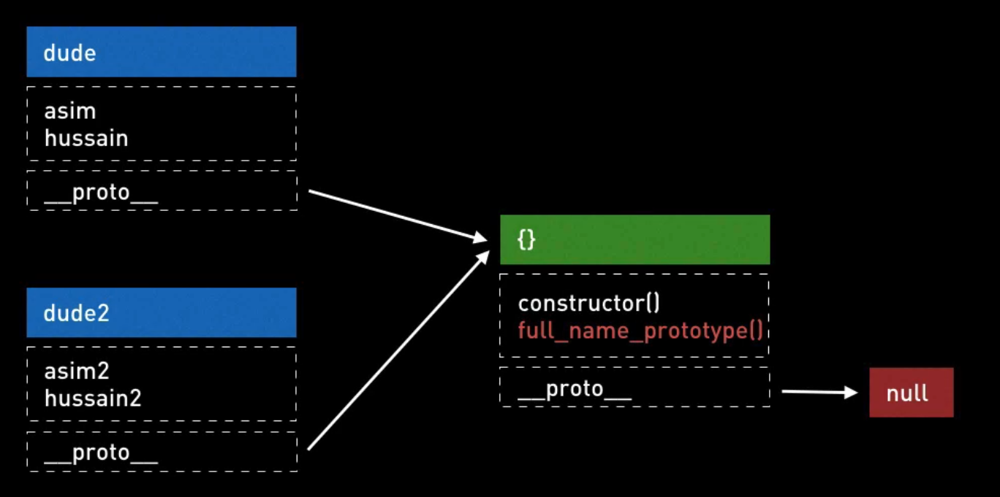
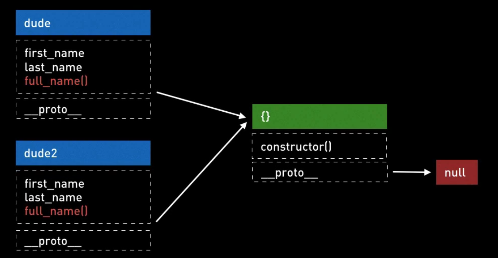
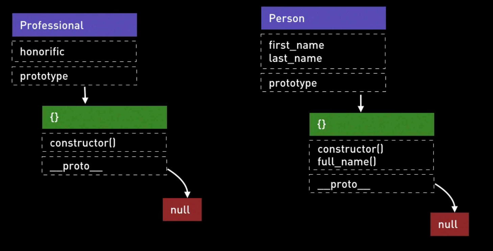
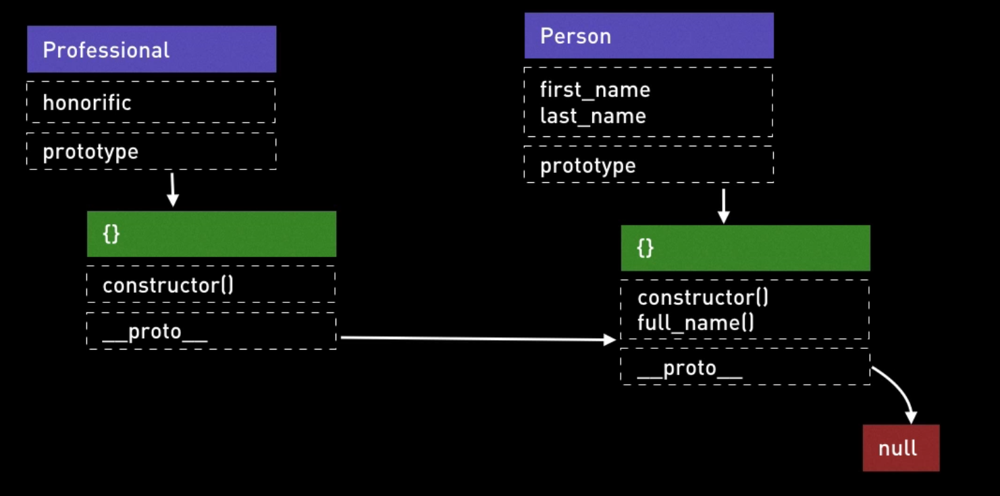
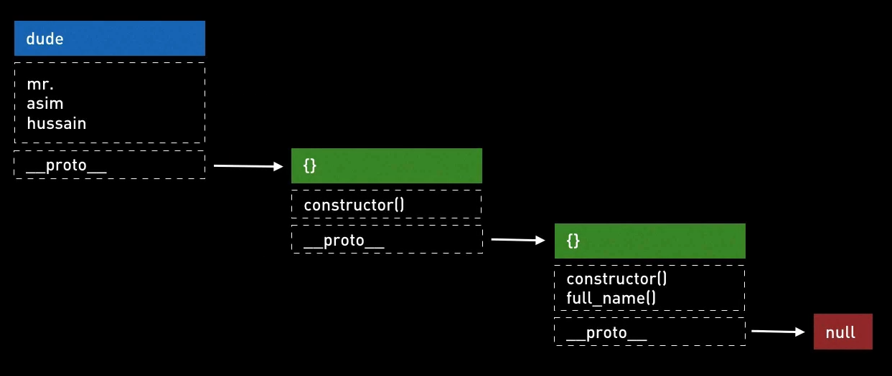

# Advanced js

### Что такое 'use strict' и для чего он нужен

Что делает 'use strict'? Это частый вопрос, который мы можем встретить на собеседовании, неплохое начало для разговора.

Это простой вопрос, обычно ожидают, что кандидат на собеседовании знает ответ на него. Но даже если это простой вопрос
вы все еще можете произвести впечатление на интервьюера, показав глубокое понимание значения этого ключевого слова.

Так что же такое strict mode?

Strict mode позволяет вам разместить программу или функцию в так называемый строгий операционный контекст. 
И я собираюсь объяснить что это значит с несколькими примерами, но если в двухсловах, он позволяет легче дебажить код.
Ошибки кода, которые бы в противном случае были проигнорированы или втихую сфейлелись, теперь будут генерировать
ошибки или выбрасывать исключения. Это позволяет вам раньше обнаружить ошибки в коде и быстро направляет вас к источнику
проблемы.

Так первая вещь о которой вы должны сказать - это как включить его. Как включить strict mode в JS файле?

Один из путей, это просто напечатать строку 'use strict' и поместить ее в самом вверху файла. Если вас попросят на интервью
записать его, помните никогда не пишите как use strict. Это не специальное ключевое словое use и не специальное ключевое
слово strict. Это строка. И вы можете спросить, почему это строка? Это выглядит довольно странно. И ответ по-настоящему
очевидно прост. Когда эта функция была впервые разработана и реализована, старые браузеры не поддерживали ее, 
только новые браузеры поддерживали ее. 
Если бы решили использовать ключевое слово «use» и ключевое слово «strict» при загрузке этого файла в более 
старом браузере, браузер, который бы не знал об «use strict», выдал бы ошибку. И поэтому то что они сделали, они просто
положили его в строку и так старые браузеры читали этот файл, говорили "воу да это же строка в вверху файла, они ничего не делает
и поэтому я просто проигнорирую ее". А в новых браузерах, если он увидит строку 'use strict' они поймут, что необходимо
переключится в strict mode operating context.

Это один из путей, в котором можно сказать JS, чтобы он смотрел на код в strict mode. И используя данный подход,
strict mode будет применяться ко всему коду по всему файлу, но есть и другой способ.

```javascript
// Not strict mode... 
function newCode() {
  "use strict"
  // Strict mode...
}
// Not Strict mode...
```
Если вы возможно когда-либо работали с легаси JS кодом, очень-очень старым JS кодом. Я серьезно сомневаюсь, что вы
на самом деле окажетесь в данной ситуации, потому что 'use strict' существует уже очень давно. Но если у вас есть
полное знание, это действительно возможно применить 'strict mode' только к части кода, с помощью добавления 'use strict' 
в верхнюю часть блока функции, затем все что будет под данной строкой, будет читаться в strict mode, а все что снаружи блока
функции будет в non-strict mode. 

Я показал, как включать его. А какого назначение 'use strict' мода? Что он на самом деле делает?

Одна из первых вещей это, что в 'use strict' моде использование переменной перед тем как она была определена вызовет ошибку.

Например, без strict mode назначение значения недекларированной переменной возможно и будет автоматически создана глобальная
переменная с таким именем. В JS всегда есть глобальный объект и в нем находятся все глобальные переменные и 
глобальные функции. В браузере глобальный объект - 'window'. Но если вы используете его внутри node, глобальный объект
будет называться 'global'.

Поэтому с помощью декларирования asim = 1; мы создаем глобальную переменую, глобальное свойство на глобальной переменной
window, с названием asim и мы назначаем ей значение 1.

```javascript
asim = 1;
console.log(window.asim); // 1
```

Так мы разобрались как это работет...Так почему это плохая вещь? Почему это раздражает? Позвольте мне показать специфичный
пример, когда это может быть невероятно разочаровывающим. Давайте представим, что в моем приложением, я декларировал переменную
под названием theVal. Я декларировал ее должным образом, используя theVal в самом начале моего файла и назначил ей
значение 0. И затем, где-то в приложение я решил изменить значение моей theVal переменной в 1, но я сделал глупую ошибку -
вместо того, чтобы напечать theVal, я написал thVal. И наконец я использую переменную theVal в 'if' операторе, думая будто
я установил значение в 1 и, ожидая что выведет Hello. Но, к сожалению, Hello не будет выведено в консоле, потому что была совершена ошибка
в названии переменной.

```javascript
var theVal = 0;
//
thVal = 1;
//
if (theVal > 0) {
    console.log("Hello")
}
```
  
А теперь если мы используем 'use strict'. Вызов недекларированной переменной вызывает ошибку.

```javascript
"use strict";

var theVal = 0;
//
thVal = 1; // вызывает ошибку: thVal is not defined
//
if (theVal > 0) {
    console.log("Hello")
}
```

Другая фича "use strict" - то что она останавливает вас от использования слов, которые уже зарезервированны для
будущих версий JS. Давайте например создадим переменную let и назначим ей значение - 1. Затем перезагрузим страницу и все
будет впорядке. 

```javascript
var let = 1;
```

Но если я добавлю "use strict" на вверх файла, вы увидете ошибку вызванную данной переменной

```javascript
"use strict"

var let = 1; // Вызовет ошибку: Unexpected strict mode reserved word
```
Причина данной ошибки, что слово let уже зарезервированно для будущих версий JS. По факту уже используется
в ECMA script 6 версии JS

Еще одна фича 'use strict' - вы не можете удалять функции, переменные или аргументы функций.

Давайте посмотрим на примере без использования use strict. Если вы всего-лишь напечатаете var foo = 0 и затем
попытаетесь удалить foo, перезагрузите страницу, не возникнет никакой ошибки...Тоже самое с функциями

```javascript
var foo = 1;
delete foo;

function moo() {}
delete moo;
```

А если вы будете использовать 'use strict' mode, то при удалении будет вызвана ошибка

```javascript
"use strict"

var foo = 1;
delete foo; // Delete of an unqualified identifier in strict mode

function moo() {}
delete moo; // Delete of an unqualified identifier in strict mode
```

И следующая вещь, о которой я хотел бы рассказать - это ключевое слово eval и use strict mode.
Strict mode делает eval немного безопаснее.

Например в non-use strict mode вы можете делать вещи, такие как var eval = 1; или именовать так функции, и никакой ошибки
не будет вызвано.

А в use strict mode будет вызвана ошибка

```javascript
"use strict"

var eval = 1; // Unexpected eval or arguments in strict mode
```
Если вы знаете eval, он позволяет вам оценивать выражения JavaScript, просто передавая строку. Таким образом,
он позволяет вам выполнять только произвольные биты типа кода JavaScript в 'var a = 1'.

```javascript
eval('var a = 1');
console.log(a); // 1
```
Этот код выполняет 'var a = 1', но в non-use strict mode переменная A вытекает из выражений eval, поэтому, если
вызвать console.log (a); вы можете видеть, что он выводит значение переменной A, которая фактически создается или 
определяется в блоке eval. Таким образом, вы можете представить себе ситуации, в которых это может вызвать проблемы с 
безопасностью или просто загрязнить ваше собственное пространство имен.

Но если мы используем use strict mode, любые переменные, что вы определите внутри eval существуют только внутри eval и
не вытекают наружу.

```javascript
'use strict'

var a = 2;
eval('var a = 1');
console.log(a); // 2
```

### Javascript передает переменные по ссылке или по значению?

Вопрос заключается в том, что когда вы передаете перменную A в функцию foo как параметр, вы передаете по значению переменной
или по ссылке? 

Быстрый ответ на этот вопрос заключается в том, что передаваемые примитивные типы, такие как: строки, числа, булин переменные,
передаются по значению, а объекты передаются по ссылке. И прекрасно, это по правде правильный ответ, но если вы дали
мне такой ответ мгновенно, я бы задал сразу следующий вопрос, который был бы что-то вроде "Объясни мне что означает pass-by value
и pass-by reference". Потому что я хочу знать что ты не только просто запомнил этот ответ, но и глубоко понимаешь, как это
происходит.

#### Позвольте объяснить для начала что значит pass-by value.

Так что же означает то, что если вы изменяете значение примитивного типа внутри функции, изменения не будут влиять на переменную
во внешней области видимости.

```javascript
'use strict'

var a;
function foo(a) {
    
}
```

В данном примере переменная A находятся во внешней области видимости, а внутри фукнции находится область видимости функции
или внутренняя область видимости. Так если var a = 1; 1 - примитивный тип и я сделаю console.log(a) во внешней области видимости
и также я вызову функцию foo с переменной a, внутри которой я измению переменную на значение 2, то консоль лог все равно
выведет 1. И это потому примитивные типы, когда они передаются в функцию, они передаются по значению. Образ мышления о том, что
на самом деле означает pass-by value, есть по-настоящему передача копии переменной A. Поэтому все что вы делаете с переменной
внутри тела функции не будет никак влиять на переменную A во внешней области видимости.

```javascript
'use strict'

var a = 1;
function foo(a) {
    a = 2;
}
foo(a);
console.log(a); // 1
```

#### Что же такое pass-by reference? 

Когда вы передаете что-то по ссылке, вы передаете что-то указывающее на что-то еще. Так с передачей JavaScript объект
передает его по ссылке, когда изменяете свойство этого объекта изнутри функции, изменения будут отражены во внешней
области видимости. Когда вы передаете объект в функцию, вы передаете не ссылку объекта, вы передаете что-то указывающее на 
А объект.

```javascript
'use strict'

var a = {};
function foo(a) {
  a.moo = false;
}
foo(a);
console.log(a); // Object {moo: false}
```

Позвольте мне изменить код немного. Внутри функции вместо изменения свойства A, я буду изменять именно то на что указывает
A переменная. И если мы перезагрузим страницу, то увидим, что переменная А не изменилась. В JavaScript когда мы говорим, что
мы передаем по ссылке (pass-by reference), мы не можем изменять то на что указывает A, поэтому если вы передаете в A, это не
изменит то на что оно указывает. Мы можем только изменять свойства А во что-то другое или добавлять свойства. Мы не можем
изменять то на что указывает А.

```javascript
'use strict'

var a = {'moo': 'too'};
function foo(a) {
  a = {'too': 'moo'};
}
foo(a);
console.log(a); // Object {moo: 'too'}
```


## Types Equality

### Какие типы бывают в Javascript?

Сейчас в ECMAscript 5 спецификация определяет 6 различных типов в JS. У нас есть 5 примитивных типов и один непримитивный
тип. 

```javascript
"use strict";

Boolean // true, false
Number  // 1, 1.0
String // "a", 'a'
Null  // null
Undefined // undefined

Object  // {} , new Object()
```

Со стороны примитивных типов у нас есть boolean, number, string, null, undefined и непримитинвый тип - объект.

Так мы можем использовать функцию в JS, называемую **typeof**, способную выводить тип значения, которую мы в нее передадим.

```javascript
typeof(1) // "number"
typeof('a') // "string"
typeof('true') // "boolean"
typeof('undefined') // "undefined"
typeof('null') // "object"
typeof({}) // "object"
```

Проблема возникает, когда мы получаем тип примитива Null, потому что функция, возвращает нам, что это объект, хотя
null - null. И этот баг известен уже очень давно, к сожалению его пофиксить в данный момент невозможно, так как это
вызовет ряд проблем.

На самом деле вопрос простой, но можно задать посложнее, например:

Какая разница между динамически типизированным языком как JavaScript и статически типизированным языком, таким как Java?

Представьте, что мы пишем Java код. Поэтому если мы пишем Java, мы можем определить строку так:

```java
String a = 'moo';
```

И так должна создаться переменная называемая А и в статически типизированном языке, как Java, мы говорим Java, что эта
A будет содержать строки и только строки. И затем мы говорим Java что переменная А будет содержать строку moo. Так
в статически типизированном языке как Java перед тем как код запустится, пока вы пишите код, вы должны указать, какие
именно типы каждая переменная должна содержать. Если позже вы попытаетесь сделать что-то подобное

```java
String a = 'moo';
a = 1; // Вызовет ошибку
```

Потому что Java знает, данная переменная может содержать только строки и вы пытаетесь заставить переменную содержать число.

Когда как в JavaScript мы можем сделать что-то подобное:

```javascript
var a = 'moo';
```

В JS у нас есть переменная под названием А, но тип переменной А на самом деле определяется тем значением, которое мы
присвоили А. Если мы используем функцию typeof(a), то получим результат "string". Но позже мы можем изменить переменную
А и указать,  что она равна числу 1 и теперь typeof будет показывать нам "number"

```javascript
var a = 'moo';
typeof(a); // string
a = 1;
typeof(a); // number
```

Это и означает динамически типизированный язык. С JavaScript тип переменных определяется динамически в ран тайме, когда мы
действительно запускаем приложение. В то время как в Java typeof переменной определяется статично, в то время когда мы пишем
код для нашего приложения.

В чем преимущество одного над другим? Я бы сказал, что нам самом деле нет чистого преимущества одного над другим.
Они оба полезные в разных сценариях и в различных ситуациях. С динамически типизированным языком вы проще заходите и погружаетесь,
низкий порог вхождения. Он намного легче в написании быстрых JS приложений или быстрых Python приложений. Но вы сможете
обнаружить ошибки только в ран тайме. В тот момент, когда приложение реально запущено. Если, возможно, в нашей логике
приложения некоторая функция ожидала, что А будет строкой, но мы каким-то образом изменили ее на число в какой-то момент
выполнения, мы обнаружим это только тогда, когда запустим приложение и возможно оно выдаст ошибку или даже хуже, возможно
ошибке в самой программе и затем приложение продолжит молча вести к большим и к худшим ошибкам, ведущим к еще большим
ошибкам. 

В то время как в статически типизированном языке, как Java, когда мы компилируем приложение, компилятор сам бросит ошибку, если мы
создадим переменную, содержащую неверный тип. ТАк мы можем раскрыть проблемы очень очень рано в нашем цикле разработки.
Это происходит за счет времени создания наших приложений и немного сложнее написание.

Есть и другие преимущества использовать статически типизированный язык. Некоторые проблемы, связанные с управлением памятью
и производительностью, могут более жестко контролироваться статически типизированными языками по сравнению с динамически
типизированными языками. 

Другой последующий вопрос, который я могу задать. 
Вы могли бы заметить, что в наших примитивных типах, смешанных между собой, у нас есть два типа, которые, возможно,
действительно означают одно и то же. У нас есть null, и у нас есть undefined. 
У нас есть два, казалось бы, избыточных способа представить эту концепцию бесполезной, но на самом деле между ними 
есть небольшая разница.

Так, если я объявлю переменную А в нашем приложении и вызову console.log(a)

```javascript
var a;
console.log(a); // undefined
```

Вы можете видеть, что я на самом деле не назначил значения для этой переменной и поэтому приложение не знает какого типа
А, коносоль лог выведет undefined. Потому что это то, что JavaScript устанавливает для переменной А, когда он не знает тип
переменной, когда переменная не была инициализированная с другим значением. Так undefined используется JavaScript и
означает отсутствие значения. Он используется для неинициализированных переменных, поэтому такие переменные, как А, не 
были инициализированы другим значением. Он используется для пропуска параметров в функциях, и он используется для 
неизвестных переменных и свойств для таких вещей, как объект window.

Поэтому если мы сделаем window.hello и это несуществуемое свойство в объекте window, то вернется undefined. 

Так для меня undefined - это основная функция JavaScript, она используется движком JavaScript, чтобы сообщить вам, что
это либо неинициализировнная переменная, либо параметр, осутствующий в списке параметров функции, либо, возможно,
неизвестное свойство объекта.

В то время как, если бы мы напечатали var a = null;

```javascript
var a = null;
console.log(a); // null
```

То консоль вывело бы как очевидно null. Но я бы сказал, что null используется программистами для обозначения отстутствия 
значения. Но JavaScript движок никогда не установит значение в null для вас, он всегда будет устанавливать undefined, если
он не значет что это. Только программисты устанавливают переменную в null. Я думаю, что это тонкое, но важное различие
между undefined и null.

Другой интересный факт относительно null и undefined, который я думаю представляет интерес, пришедший из другого
статически типизированного языка. В языке, например, Java, если мы написали String a = null, и я знаю, что это недопустимый
код в JavaScript, но здесь мы говорим, что есть переменная с именем А, и это строковая переменная и значение этой переменной
в том, что мы еще не знаем, что это такое, поэтому я хочу сказать, что это null. В статически типизированных языках 
null - это не само значение, а концепция отсутствия значение, тогда как в JavaScript Null - значение. И мы знаем, что
null - значение, потому что мы можем написать typeof null и он будет иметь тип - object(null). TypeOf Null имеет значение
null, а тип Null имеет одно значение и только одно значение, которое является строкой, которая является ключевым словом null.

Тоже самое касается undefined.

### Какая разница между == и ===

Первый вариант - двойное равенство, которое называется равенством. Тройное равенство - строгое равенство в JavaScript.

Если вкратце, то тройное равенство проверяет как и тип, так и равенство значений, тогда как двойное равенство проверяет
равенство только значений слева от оператора и справа. Лучший способ объяснить и понять различия между равенством и 
строгим равенством это только черзе ряд примеров.

Например если мы будем писать в консоли:

```javascript
0 === 0; // true
0 !== 1; // true
0 == 0; // true
0 != 1; // true
```

Все это очень очевидно, а вот если мы начнем использовать другие значения:

```javascript
'' == '0' // false
0 == ''  // true
0 == '0'  // true

0 === '' // false
0 === '0' // false
```

Во время двойного сравнения JavaScript пытается разумно найти способ преобразования обоих значений, чтобы они были одного
типа. Поэтому в примере 0 == '0', JS пытается конвертировать число с левой стороны в строку, потому что он обнаруживает
строку с правой стороны и мы видем, что JS делает используя функцию String и передает в нее параметр 0

```javascript
String(0) == '0' // вот что на самом деле происходит при сравнении числа и строки
```

В JavaScript это называется Приведение типа (type coercion) и когда вы используете оператор двойного сравнения или
оператор нестрого равенства, это то, что JS пытается сделать, он пытается разумно привести оба значения к одному типу.

Это может привести программисто в затруднительное положение, например, давайте я перезагружу страницу и если я сделаю
false == 'false' это будет false.

```javascript
false == 'false'; // false
```

Из-за того что JS пытается конвертировать булин false в строку. 

```javascript
String(false); // 'false'
```

Но тогда почему же мы имеем false, если 'false' == 'false'? Причина что false == 'false' возвращает false в том, что 
JS пытается конвертировать boolean false в строку, а пытается конвертировать строку в boolean. 

```javascript
Boolean('false'); // true
```

Если значение на какой-либо стороне оператора равенства другого типа JS пытается привести к одинаковому типу значения.
И правила по которым JS пытается делать это очень сложные и сложно запоминаемые.
 
https://dorey.github.io/JavaScript-Equality-Table/
 
Поэтому я только покажу вам данную таблицу, в которой видно странные поведения при строгом равенстве против обычного равенства. Так в строгом равенстве, когда 
сравнивают true с true получают результат true. И любые другие варианты вернут false. И вы можете знать заранее что произойдет
когда вы сравнивает одно значение с другим. Когда вы начинаете использовать оператор нестрогое равенство то то, что возвращается
будет для вас очень неожиданным, поэтому лучше всегда использовать строгое равенство. 

### Что такое NaN и как мы проверяем его?

Какого типа NaN? NaN в JS расшифровывается как not a number, и если мы заглянем в консоль, то увидим, что у нас есть свойство
значения NaN

```javascript
NaN // NaN
```

а typeof(NaN) будет как не странно - number
```javascript
typeof(NaN); // number
```

Хоть это и означает not a number. И он используется чтобы определять числа, которые не являются настоящими числами, возможно
результат какого-нибудь неправильного расчета. Например, ели мы попробуем сделать 'abc'/4 , это выведет NaN.

```javascript
"abc"/4 // NaN
```

И это можем показать довольно простым. Но есть несколько по-настоящему удивительных характеристик у NaN, которые могут оберунтся
в ужасные баги, если вы не ознакомлены с ними. 

Первая вещь, которую люди находят очень запутанной в отношении NaN, и это на самом деле является официальной спецификацией
для JavaScript, заключается в том, что NaN сравнивают с чем-либо еще в мире, поэтому, если NaN равен false,
это нормально, NaN равняется false - false.

```javascript
NaN == 1 // false
NaN == false // false
```

Если сравнивать NaN с любым значением всегда будет false, но самое путающее, что если NaN сравнить с самим собой, это так же
будет false!! 

```javascript
NaN == NaN // false
```

Как же на самом деле проверяется является ли значение NaN? Вы не можете сравнить NaN с NaN. К сожалению есть метод, но 
у него есть свои проблемы. Существует встроенная функция в JavaScript - isNaN. Так если вы передадите в isNaN(NaN) вернется
true. Это один путь как мы можем проверять на NaN. Но у данной функции есть свои проблемы, например, если передадим в нее
число 1, то получим false и это нормально, но если мы передадим в нее строку "1", то это снова будет false. Но если вы
передадите строку "А" то вернется true

```javascript
isNaN(1) // false
isNaN("1") // false
isNaN("A") // true
```

То что здесь произошло, как мы и проходили ранее, это неявное принуждение (implicit coercion). Так в isNaN функции 
параметр, которые передается в нее приводится к типу. JS пытается привести A в число, чтобы проверить на NaN. Поэтому
когда он пытается привести А в число, Number("A") - NaN. Поэтому isNaN(Number("A")) - true.

Но есть небольшой трюк в JS. 
Таким образом, единственный способ полностью проверить, является ли переменная isNaN, так как NaN - это единственное
значение JavaScript, которое обрабатывается неравномерно для себя, вы всегда можете проверить, является ли значение 
isNaN, проверив равенство для себя, используя оператор !==. Так когда мы используем оператор !==, например, 

```javascript
var a = NaN;

a !== a; // true

a = 1;

a !== a; // false

a = 'a'
a !== a; // false
```

Если А равно NaN из-за странного свойства NaN, где оно не равно себе. Так как это единственный тип, который при равенстве 
самого с собой выдает false можно использовать данные трюк, чтобы определить является NaN значение или нет.

### Какие различия в областях видимости в JavaScript?

Под областью видимости мы имеем ввиду продолжительность жизни переменной, т.е. где эта переменная видна и доступна для
вас чтобы использовать ее в коде.

В JavaScript мы имеем не так много, но несколько различных типов областей видимости. 

Любые переменные объявленные вне функций, например, я объявил переменную и назвал ее asim, которая находится в глобальной
области видимости. Такие переменные называются глобальными переменными и они доступны в любой части вашего приложения, включая
глубоко вложенные, внутри кучу других функуций, вы все еще будете иметь доступ к таким переменным, до тех пор пока они не
будут переопределены в других областях видимости.

```javascript
var asim = 1;
``` 

Другой способ определить глобальную переменную - добавить ее как свойство в глобальный объект. И так как мы находимся в
браузере, то глобальный объект - window.

```javascript
window.moo = 1;
console.log(moo);
```

И так мы можем определить нашу новую глобальную переменную через новое свойство глобальное объекта.

Причина по которой мы можем использовать moo как глобальную переменную, таким же образом как мы можем использовать asim 
как глобальную переменную - это то что все глобальные переменные на самом деле являются свойсвами объекта window.
Поэтому если я напишу window.asim - получу значение нашей глобальной переменной asim.  

Этот объект window доступен только в браузерах, если вы кодите JavaScript внутри node, то глобальный объект уже будет - global.

И так у нас есть переменные в глобальной области видимости. Другая область видимости, которая есть в JavaScript - область видимости функции
или локальная область видимости переменных.

Так если внутри нашей функции moo я объявлю переменную foo и задам ей значение 1, и затем использую эту переменную снаружи
функции moo, то получу ошибку что данная переменная не определена.

```javascript
function moo() {
 var foo = 1;    
}
console.log(foo) // ReferenceError: foo is not defined
```

Все из-за того что область видимости переменной foo находится и доступная только изнутри области видимости, изнутри
блока этой функции, в которой она была определена.  

Если мы попытаемся вывести переменную внутри функции то все будет хорошо

```javascript
function moo() {
    var foo = 1;
    console.log(foo)
}

moo(); // 1
```

Если вы пришли из других языков, таких как Java или даже Python, или С++, вы можете подумать что JavaScript имеет что-то
подбное области видимости уровня блока (block level scope). Например:

```javascript
for (var i=0; i< 5; i++) {
    var j = 5;
}
```

В других языка переменная J и возможно переменная I будут видны только внутри блока цикла. Снариж этого блока переменные
будут не видно, но по факту в JavaScript если мы попытаемся вызвать снаружи цикла переменную J, выведется значение 5.

```javascript
for (var i=0; i< 5; i++) {
    var j = 5;
}

console.log(j); // 5
```

Это потому что JavaScript не имеет такого концепта, как область видимости уровня блока. Переменные внутри цикла будут
доступны снуржи блока области видимости, в которой они были объявлены.  И потому что этот цикл for в глобальной области видимости
все что мы делаем в нем происходит в глобальной области видимости. 

Так есть только 2 места, 2 области видимости в которых ваши переменные могут существовать - function scope или global scope.

### Что такое всплытие переменных

Чтобы описать всплытие переменных, я собираюсь показать вам пример:

```javascript
"use strict";

console.log(a); // undefined
var a = 1;
```

Мы используем use strict, и из-за того что мы используем use strict, это означает, что переменная должна быть объявлена
до того как она будет использована. Поэтому данный код должен вызвать ошибку, или я это должен ожидать. Но если мы испытаем
данный код то увидим, что ошибки не последует и нам выведется undefined.

И если бы я не понимал всплытие переменных это было бы очень запутано. Но чтобы понять что на самом деле происходит нам
нужно понять что происходит у JavaScript под капотом. 

Когда JavaScript видит код как например var a = 1; он разбивает это на две строки. Первая часть будет объявление var A и 
она будет прикреплена на самом вверху страницы, и затем просто приравнивает a = 1, по типу такого:

```javascript
"use strict";
var a;

console.log(a); // undefined
a = 1;
```

Поэтому когда мы делаем console.log(a), данная переменная уже объявлена и выводится undefined, т.к. значение не было задано.

Так JavaScript автоматически поднимаем объявление переменной на самый вверх охватывающей области видимости.

Наряду с переменными JS так же будет поднимать и сами функции. Давайте посмотрим на другой пример:

```javascript
"use strict";

foo();
function foo() {
    console.log(a); // undefined
    var a = 1;
}
```

Мы вызываем функцию foo, но вызываем ее перед тем как объявили или определили что такое foo. Так что же вы ожидаете при
вызове таким образом функции?

Снова нам выводится обычный console.log(a). Потому что JavaScript способен вызывать функцию foo даже перед тем как увидит 
саму функцию foo, из-за того что происходит всплытие (подъем функции).  Когда он увидит код объявления функции, он переместит
на самую верхнюю часть какую сможет найти.

То есть произойдет нечто такое: 

```javascript
"use strict";

function foo() {
    console.log(a); // undefined
    var a = 1;
}
foo();
```

А что произойдет если мы объявим вместо функции foo переменную foo равную анонимной функции?

```javascript
"use strict";

foo(); // TypeError: foo is not a function

var foo = function() {
    var a;
    console.log(a);
    a = 1;
}
```

Мы можем быть немного запутаны, потмоу что мы думали что со всплытием это должно было перенестись на вверх области, но здесь
происходит тоже самое что и со всплытием переменных, JavaScript разобъет код на две строки и перенес наверх объявление переменной
foo, а ее значение оставит снизу, поэтому при вызове переменной без значения, которая будет равнятся undefined произойдет ошибка.  

### Что такое цепь области видимости (scope chain)?

До этого мы разговаривали о различиях между областями видимости в JavaScript. Я упоминал о глобальной области видимости и
так же о области видимости функции. Важный факт о области видимости функции - это то что они могут вкладываться в другие
области видимости функций. И когда внутренней функции нужно использовать переменную, она ищет вверху и это называется цепью области видимости.

Сначала она ищет переменные внутри собственной области видимости функции, затем, если она не может найти их, то начинает
искать во внешней области видимости функции, и если не находит там, то уже ищет до тех пох во внешних областях, пока не дойдет до
глобальной области видимости.

Вы можете подумать, что это все так просто и вы  легко понимаете данный концепт. Но есть один очень важный факт, который
нужно знать.

Цепь областей видимости определяется тем, как программа записывается в файл. Так что лучший способ объяснить это с помощь
пары примеров:

```javascript
"use strict";

function foo() {
    console.log(myvar); // Uncaught ReferenceError: myvar is not defined
}

function goo() {
    var myvar = 1;
    foo();
}

goo();
```

У нас есть функция foo, внутри которой мы хотим вывести в консоль переменную myvar Затем есть функция goo внутри которой
мы объявляем переменную myvar и задаем ей значение 1 и вызываем внутри функцию foo. После этих функций мы вызваем в глобальной
области видимости функцию goo.

И если мы запустим данный код, то получим ошибку Uncaught ReferenceError: myvar is not defined

Причина этому, что цепь областей видимости определяется Лексически и это слово значит, что цепь областей видимости определяется
в порядке, в котором код написан на странице или файле.

Так переменная myvar не доступна в foo функции потому что лексически переменная не была объявлена над функцией foo.

Чтобы объяснить это проще, давайте поменяем кое что в коде:

```javascript
"use strict";

function goo() {
    var myvar = 1;
    function foo() {
        console.log(myvar); 1
    }
    foo();
}

goo();
```

Теперь консоль лог возвращает единицу, потому что цепь областей видимости лексически определена, поэтому когда внутри функции
foo вызывается коносоль лог, он ищет переменную myvar, сначала в своей области видимости, а затем во внешнюю область видимости,
которая у нас является goo функция и здесь он находит, данную переменную. 

Подведем итог, цепь областей видимости определяется в том порядке, в котором код написан на странице или файле, то есть 
начиная оттуда, где мы объявляем функциюю, а не где ее вызываем.

### Что такое IIFE

IIFE - расшифровывается как Immediately Invoked Function Expression

Для того чтобы понять почему мы можем использовать ее, рассмотрим пример:

В этом примере у нас будут два файла main.js и other.js:

main.js
```javascript
"use strict";

var thing = {'hello': 'main'};
console.log('main: ', thing);
```
other.js
```javascript
"use strict";

var thing = {'hello': 'other'};
console.log('other: ', thing);
```

И в index.html мы подключаем оба этих файла

```html
<!doctype html>
<html lang="en">
<head>
<meta charset="UTF-8">
             <meta charset="UTF-8">
             <title>Document</title>
             <script src="main.js"></script>
             <script src="other.js"></script>
</head>
<body>
  
</body>
</html>
```

И когда запустим index.html мы увидим что в консоль логе у нас выводится оба наших объекта по порядку, в котором они
были подключены в html

Вопрос будет заключатся в том, так как мы использовали две глобальные переменные, первая - thing в main.js и  вторая с точно
таким же название в other.js. И какая же остается у нас в самом конце? Если мы напишем в консоле thing, то увидим, что
переменная была перезаписана последним объявление в other.js. 

Как мы сможем решить данную проблему? 

До этого мы изучили разницу в областях видимости. У нас есть глобальная область видимости, которую мы видим здесь, когда
объявляем переменные прямо в глобальной области. Так же у нас есть область видимости функции и все что мы объявляем в 
в ее области, существует только внутри блока функции. Поэтому с помощью этой информации мы можем решить нашу проблему.

Если в other.js мы напишем функцию otherScope и поместим в нее наш код. И затем вызовем эту функции, код внутри функции
будет находится в области видимости функции и не будет влиять на глобальные переменные.

other.js
```javascript
function otherScope() {
    "use strict";
    
    var thing = {'hello': 'other'};
    console.log('other: ', thing);
}
otherScope();
```

Но такой код выглядит слишком громоздким и долго печатемым для разработчиков. И на самом деле есть более сжатый и 
лаконичный способ реализации этого. Вместо того чтобы использовать именованную функцию, мы можем использовать анонимную и
если мы обернем ее в скобки, то сделаем ее вызываемой и затем сможем вызвать ее с помощью () - это и называется IIFE

```javascript
(function() {
    "use strict";
    
    var thing = {'hello': 'other'};
    console.log('other: ', thing);
})();
```

### Что такое замыкание функций?

Начнем с данного примера, где у нас есть функция, которая выводит имя в консоль лог.

```javascript
function sayHello(name) {
    var text = 'Hello ' + name;
    console.log(text);
};

sayHello('Asim');
```

А теперь сделаем немного интереснее нашу функцию, вместо простого вывода имени, я хочу чтобы наша функция возвращала функцию, которая
потом будет выводить имя. Давайте я покажу, как это будет выглядеть:

```javascript
function sayHello(name) {
    var text = 'Hello ' + name;
    return function() {
        console.log(text);
    }
};

sayHello('Asim');
```

Но теперь ничего не происходит, и когда мы вызываем нашу функцию, нам выводится в консоль function(){ console.log(text)}.
Потому что нам возвращается функция, для этого нам нужно еще раз вызвать ее 

```javascript
sayHello('Asim')();
```

Дальше мы можем сделать вот так:

```javascript
var sayAsim = sayHello('Asim');
sayAsim();
```

Что же здесь происходит на самом деле? Когда мы вызываем SayAsim(), мы вызываем функцию, возвращаемую sayHello,
и эта функция выводит текстовую переменную, объявленную в sayHello, но в соответствии с правилами области 
видимости, когда SayHello исчезает, любые переменные объявленные внутри нее, они выходят из области видимости и удаляются.
Но возвращаемая функция сохраняет ссылку на любые переменные, которые необходимо выполнить. Таким образом, 
он использует текстовую переменную, он сохраняет ссылку на текстовую переменную. Так называемая Closure.

Замыкания могут ссылаться на переменные во внешних областях и области видимости, внешней по отношению к себе.

Сейчас я вам покажу специфичный пример на собеседованиях, который проверяет знание замыканий:

```javascript
var foo = [];
for (var i = 0; i < 10; i++) {
    foo[i] = function() { return i };
}

console.log(foo[0]());
console.log(foo[1]());
console.log(foo[2]());
```

И так у нас есть массив foo, и каждый раз, когда мы проходим циклом for по массиву 10 раз, мы создаем функцию, которая возращает
i, i - находится во внешей области видимости. 

```javascript
for (var i = 0; i < 10; i++) {
```

Здесь мы получаем доступ к глобальной области видимости, а затем восстанавливаем ее в индексе массива foo с помощью той же
переменной i. И дальше мы создаем другое замыкание

```javascript
foo[i] = function() { return i };
```

Для работы данной функции необходима переменная i, которая находится во внешней области видимости. 

Так что же вы ожидаете на самом деле увидеть в console.log?

На самом деле консоль выведет 3 раза 10. 

Может быть вы ожидали что `foo[0]()` вывело бы 0, потому что когда `foo[0]` был создан при создании функции i должна была быть
0 и так далее в зависисмости от индекса.

Но если вы ожидали этого, вы по-настоящему упускаете один важный факт. И этот факт - когда замыкание создается, оно не
получает копию i, замыкание указывает на само значение i во внешней области видимости. 

Так к тому времени, как мы вызовем `foo[0]` наш цикл уже будет заверешн и i = 10; Поэтому когда мы вызываем эти функции
нам всегда возвращается 10.

Если мы хотим чтобы выводилось так же как и мы считали, что будет выводится, то мы можем использовать нашу предыдущую тему с
IIFE и использвание этих двух тем поможет решить проблему.

```javascript
var foo = [];
for (var i = 0; i < 10; i++) {
    (function(){
        var y = i;
        foo[i] = function() { return y };
    })();
}

console.log(foo[0]());
console.log(foo[1]());
console.log(foo[2]());
```

И так что здесь происходит? Для каждого цикла нашего for цикла, мы собираемся выполнять IIFE и помним, что функция имеет
свою собственную внутреннюю область видимости, поэтому когда функция будет вызвана, мы создадим переменную Y, и назначим
что она будет равняться значению переменной i, которое будет на момент вызова функции. Поэтому когда i=0, то y=0 и тд.
И дальше мы просто возвращаем переменную Y вместо i в нашем замыкании. 

Но так же есть способ, выглядещий более опрятно. 

Вместо создания новой переменной, мы можем передать параметр в нашу IIFE

```javascript
(function(y){
    foo[y] = function() { return y };
})(i);
```

То есть, когда мы проходим циклом, мы вызываем нашу IIFE и передаем в параметры i, которая передается в нашу функциюю
как Y, помним что примитивные типы передаются by value, не by reference. Эта переменная Y не относится к той же самой переменной
i из внешней области видимости, это копия. Поэтому когда мы используем Y и возвращаем ее, мы возврвщаем копию Y и это дает
давольно много функциональности 

Итоги:

* Замыкание - это функция вместе со всеми внешними переменными, которые ей доступны. В JS обычно, говоря "замыкание функции",
подразумевают не саму эту функцию, а именно внешние переменные.
Иногда говорят "переменная берется из замыкания". Это означает - из внешнего объекта переменных. 

* Замыкание может ссылаться на переменные или функции из внешней области видимости, даже если эта область видимости функции
уже вышла.

* Замыкание указывает на текущее значение переменной внешней области видимости, не значение переменной внешней области 
видимостти когда замыкание было создано.

## Object Orientation

### Что означает this в javascript?

Прежде чем начать с того, что означает this в JS. Давайте пробежимся через несколько экспериментов. 

Первый эксперимент:

```javascript
console.log(this);
```

Просто выведем значение this вне всяких функций в глобальной области видимости. И получим объект window. То есть исползуя
this в глобальной области видимости, this указывает на глобальный объект window.

Если это так, то проведем еще несколько экспериментов:

```javascript
this.assim = 1;
```

Если это так, то установив свойству assim значение 1, на нашем глобальном объекте должно появится свойства с таким значением.

И если мы выведем все в консоль:

```javascript
console.log(this.assim); // 1
console.log(window.assim); // 1
console.log(assim); // 1
```

Так ведет себя this, если мы используем его в глобальной области видимости.

Как же ведет себя он, если мы будем ссылаться на this внутри функции.

```javascript
function checkThis() {
    console.log(this);
}
checkThis(); // window object
```

И снова как вы видете, this указывает на глобальный объект window. И сколько бы мы не пробовали экспериментировать, мы бы
постоянно могли приходить к заключению, что this постоянно указывает на глобальный объект. Но на самом деле нет.

Позвольте показать другой пример:

```javascript
var asim = {
    checkThis: function() {
      console.log(this);
    }
};
asim.checkThis(); // Object
```

Мы создали объектa asim и задали ему свойство с ключом checkThis и значением function() {console.log(this}, то есть
создали метод в объекте, который выводит в консоль this.

Теперь вы видите, что this указывает не на глобальный объект window, а на объект. И если мы раскроем этот объект, мы обнаружим,
что this указывает на тот же объект, в котором функция checkThis была вызвана.

И так мы можем прийти к выводу, что this указывает на объект, в котором функция была объявлена. Но на самом деле...позвольте показать
вам еще один пример:

```javascript
var func = asim.checkThis;
func(); // window object
```

Теперь я обозначаю переменную func, которая указывает на метод checkThis в нашем объекте asim. И теперь при вызове этой
функции, мы видим, что this указывает на глобальный объект. 

Поэтому причина, почему я пытаюсь пройти через все это и объяснить вам, что означает this, делая множество примеров, только для
того, чтобы показать, что это может быть немного запутанным и это по-настоящему очень тяжело выявить, что же на самом деле
означает this, только с помощью экспериментов. И я видел множество разработчиков с большим опытом работы, которые не
имели хорошего понимания что такое this.

В JavaScript this определяется с помощью вызванного контекста. Т.е. определяется путем, каким была вызвана функция, если
мы вызвали checkThis таким образом:

```javascript
var asim = {
    checkThis: function() {
      console.log(this);
    }
};
asim.checkThis(); // Object
```

Если мы используем объект из которого вызываем функцию, то this будет этим же объектом.

Но если у нас нет вызываемого контекста, как например:

```javascript
var func = asim.checkThis;
func(); // window object
```

То по умолчанию javascript установит this как глобальный объект. Так что может возникнуть некоторые проблемы с тем, как 
меняется this в зависимости от того, как вызывается функция.

Сейчас я покажу одну из самых больших проблем на примере:

```javascript
var asim = {
    checkThis: function() {
      console.log(this);

      function checkOther() {
        console.log(this);
      }   
      checkOther();
    }
};
asim.checkThis(); // Object, Window
```

Теперь когда я вызываю asim.checkThis, у нас будет выводится в консоль this внутри функци checkThis и вызываться функция checkOther,
которая будет выводить в консоль this.

И первой нам прийдет this которая указывает на наш объект asim, а вторым this - глобальный объект.

Это потому что, когда мы вызываем chackOther внутри функции, у нее нет вызываемого контекста. Поэтому this в этой вложенной
функции будет указвыать на глобальный объект. И это ловит многих людей, потому что много людей ожидают увидеть this - asim.

```javascript
var asim = {
    checkThis: function() {
      console.log(this);

      function checkOther() {
        this.moo = 1;
        console.log(this);
      }   
      checkOther();
      
      console.log(this.moo);
    }
};
asim.checkThis(); // Object, Window, undefined
```

Мы получим undefined таким образом, потому что когда мы пытаемся установить moo = 1 в этой функции, то по-настоящему
оно устанавливается на глобальный объект, потому что в этот момент на строке, где мы задачем значение moo, this указывает
на глобальный объект. А в том месте, где мы выводим this.moo в консоль, то this указывает на объект asim. 

Так что мы можем сделать, чтобы решить эту проблему?

Первая вещь, какую мы можем использвать - use strict 

```javascript
var asim = {
    checkThis: function() {
      "use strict"
      console.log(this);

      function checkOther() {
        console.log(this); // undefined
        this.moo = 1;
        
      }   
      checkOther();
      
      console.log(this.moo);
    }
};
asim.checkThis(); // Object, Window, Error: Cannot set property 'moo' of undefined
```

И один из способов решить проблему с this, это объявить переменную в самом начале указывающую на this

```javascript
var asim = {
    checkThis: function() {
      var self = this;
      console.log(self);

      function checkOther() {
        console.log(self); // undefined
        self.moo = 1;
        
      }   
      checkOther();
      
      console.log(self.moo);
    }
};
asim.checkThis(); // Object, Object, 1
```

### Что делают функции call, bind и apply?

Что делают функции call, bind и apply, когда мы знаем, что значение this такое нестабильное. Оно не определено тем как
написан код на странице. Оно не лексическое. По факту this определяется по контексту как функция была вызвана. Затем мы можем
искать способы стабилизировать this, чтобы убедиться в том, что значение будет таким, как мы задумали. В предыдущем вопросе
я показал способ, где мы присваивали this к переменной. 

Так вот функции call, bind and apply всего лишь еще одни пути, с помощью которых в JS можно заблокировать значение
this при вызове различных функций.

Так как мы на самом деле вызываем функцию?

```javascript
function a() {
  console.log(this);
}
a()
```

Так мы можем вызвать функцию всего-лишь напечатав ее название и добавив две скобки в конце. Это один из способов вызвать функцию.

Но есть кое что, что нужно знать о функция в JavaScript, функции - объекты. Объекты, которые имеют свойства и некоторые из
этих свойств - снова функции.

Если мы с помощью debug просмотрим нашу функцию, то увидим, что не смотря на то, что это функция, мы сможем заметить
связанные с ней некоторые другие свойства. У нее также есть свойства под называнием прототип, подход, который мы рассмотрим 
с вами позже. Есть свойства arguments, caller, length и name. Поэтому если мы попробуем сделать так:

```javascript
function a() {
  console.log(this);
}
console.log(a.name); // a
```

то получим имя функции. Так же, если мы добавим пару параметров в нашу функцию и вызовем свойства length, то получим
количество аргументов, которое наша функция принимает.

```javascript
function asim(pararm1, param2) {
    console.log(this);
}

console.log(asim.length); // 2
```

То есть режим выполнения с функцией сейчас работает как с объектом. Поэтому теоретически мы может добавить новые свойства
в нашу функцию. 

```javascript
function asim(pararm1, param2) {
    console.log(this);
}
asim.moo = 1;
```
Теперь у нашей функции есть свойство moo со значением 1. Поэтому вы можете обращаться с функциями как и с обычными объектами.
Например вы можете делать такие вещи:

```javascript
function asim(pararm1, param2) {
    console.log(this);
}
console.log(asim.toString()); // выведет в консоль строку с содержанием нашей функцией
```
Так вы можете просто схватить код, который создает функцию. Другой функцией, которую вы можете вызвать из своей функциии,
является call. 

```javascript
function asim() {
    console.log(this)
}
asim.call();  // Window Object
```

Так asim.call() всего-лишь вызывает нашу функцию. Так зачем нам его использовать, если это одно и тоже что и asim()?
На самом деле .call() нужно для того чтобы стабилизировать ключевое слово this.

Так this в данном примере является глобальным объектом. А если мы используем 'use strict', то this будет undefined.

Что же мы можем сделать с помощью вызова call в нашей функции? Мы можем передать в нее то, чем мы хотим чтобы был this.

```javascript
'use strict'
function asim() {
    console.log(this)
}
asim.call({});  // Object {}
```
В функцию можно передать не только объект, можно передать и любой другой примитив и this будет являться им.

Вернемся к примеру из нашей прошлой лекции. И используем в нем call:

```javascript
"use strict"

var asim = {
    checkThis: function() {
        // в данном контексте this - asim object
        function checkOther() {
            console.log(this); // Object asim
        };
        checkOther.call(this);
    } 
}
```

 Если вы помните этот приимер из предыдущего вопроса. this в функции checkOther указывал на глобальный объект, а если
 мы использовали use strict, то показывал undefined.  Но с использованием call мы передаем значением this явно, какое хотим,
 чтобы та функция имела. 
 
 Что же делать, если функция имеет параметры?
 
 ```javascript
function a(b,c,d) {
    console.log(this);
    console.log(b);
    console.log(c);
    console.log(d);
}

a.call(1,2,3,4);
```
Если мы используем call. то первым параметром мы передаем то, чем хотим было ключевое слово this, а остальные - параметры функции.

Это была функция call. А что насчет apply? Чтобы легко понять ее, просто думайте о ней, как о еще одной функции, которая
помогает нам стабилизировать this внутри функции. 

 ```javascript
function a(b,c,d) {
    console.log(this);
    console.log(b);
    console.log(c);
    console.log(d);
}

a.apply(1, [2,3,4]);
```
Первым параметром в apply мы так же передаем то, чем хотим у нас было this внутри функции, а дальше начинается различия,
вместо того чтобы передавать остальные параметры через запятую, мы передаем параметры, как массив.

Если это такие похожие функции, тогда когда нам нужно использовать call, а когда apply? 

Правильным ответом будет, что необходимо использовать call(), если только функция не принимает переменное число параметров.

Давайте я приведу пример, чтобы объяснить о чем я говорю:

```javascript
function sum() {
  var total = 0;
  for (var i = 0; i < arguments.length; i++) {
    total += arguments[i];
  }
  return total;
}

var x = sum(1,2,3);
console.log(x); // 6
```

Данна функция принимает любое количество переменных переданных в нее и проходит по ним for циклом, суммирует их и возвращает.
Мы так же могли исопльзовать sum.call(null, 1,2,3) и получили бы точно такое же значение. Но чтобы бы было, если вместо 
четко зафиксированного количества параметров, мы передавали массив:

```javascript
function sum() {
  var total = 0;
  for (var i = 0; i < arguments.length; i++) {
    total += arguments[i];
  }
  return total;
}
var things = [1,2,3,4,2,6,5,41];

var x = sum.apply(null, things);
console.log(x); // 64
```

Мы бы не могли прсото передать данный массив в функцию, потому что данная функция не принимает массив. Тоже самое и с
call, он бы понял это как один параметр - массив, поэтому здесь нужно использовать apply.

Так же есть и третий способ стабилизации this в функциях - bind().

Давайте напишем function expression:

```javascript
'use strict'
var a = function() {
    console.log(this);
};
a();
```

this будет undefined потому что мы используем strict mode. bind необходимо использовать при определении функции, не при вызове

```javascript
'use strict'
var a = function() {
    console.log(this);
}.bind(1);
a(); // 1
```

Теперь где бы мы не вызвали нашу функцию a, this всегда будет 1. Необходимо запомнить, что bind работает только с 
function expressions, когда вы их определяете.

### Что такое цепь прототипов?

Каждый объект в JavaScript имеет прототип и когда ищутся свойства в объекте, javascript будет сначала пытаться найти
свойства на самом объекте. А если он не сможет найти это свойство, то будет пытаться искать на прототипе объекта и тд.

Так давайте представим, мы у нас есть объект под название Person и экземпляр объекта называется person и я запрашиваю
javascript найти person.kind, javascript сначала проверит объект person, если там существует свойство с именем kind, и
если он не сможем найти его, то будет искать в чем-то, что называется Prototype в объекте person. И если он указывает на другой
объект, то будет искать в другом объекте данное свойства kind. В случае, если js не обнаружит данного свойства и в этом
объекте, то начнет искать в его prototype и так далее. Если в конце концов во всей цепи прототипов не будет найдено
данного свойства, то вернется undefined.

Давайте рассмотрим это на примере:

```javascript
var animal = {
    kind: 'human'
}
console.log(animal);
```

В некоторых браузерах, например Chrome вы сможете увидеть его под названием __proto__. В данном примере __proto__ указывает
на Object, у которого есть большое количество свойств и функций. 

То что я сейчас покажу, это будет только для примера, данный подход ни в коем случае не надо использовать в своем коде.

Я создам пустой объект asim и свяжу наши объекта вместе в цепь прототипов с помощью вызова свойства __proto__.

```javascript
var animal = {
    kind: 'human'
}
var asim = {}

asim.__proto__ = animal;

console.log(asim.kind); // human
```

В данном случае javascript начинает искать свойство kind в объекте asim, затем переходит к его прототипу, который мы 
связали через __proto__ и ищет в объекте animal, находит его там и возвращает в консоль human.

Так же вы можете проверить является ли один объект прототипом другого с помощью функции isPrototypeOf()

```javascript
var animal = {
    kind: 'human'
}
var asim = {}

asim.__proto__ = animal;

console.log(asim.kind); // human
console.log(animal.isPrototypeOf(asim)); // true
```

Если вы добавите свойство в прототип объекта или измените свойство это отразиться динамически. 

```javascript
var animal = {
    kind: 'human'
}
var asim = {}

asim.__proto__ = animal;

console.log(asim.kind); // human
console.log(animal.isPrototypeOf(asim)); // true

animal.kind = 'igloo';
console.log(asim.kind); // igloo
```

А что же будет если мы поменяем свойство через объект asim?

```javascript
var animal = {
    kind: 'human'
}
var asim = {}

asim.__proto__ = animal;

console.log(asim.kind); // human
console.log(animal.isPrototypeOf(asim)); // true

asim.kind = 'igloo';
console.log(asim.kind); // igloo
console.log(animal.kind); // human
```

JS если не найдет данного свойства в объекте, то просто установит его в нашем объект и задаст значение igloo.

Теперь я покажу вам другой путь реализации такой стратегии или идеи, создания или назначения прототипа объекта другому
объекту. Мы будем использовать функцию создания объекта (Object.create()), в которую мы будем передавать тот объект, который
будет являться нашим прототипом для созданного объекта.

Данная функция создает новый объект и назначает animal как прототип для него и возвращает новый объект.

```javascript
var animal = {
    kind: 'human'
}

var asim = Object.create(animal);

console.log(asim.kind); // human
console.log(animal.isPrototypeOf(asim)); // true

asim.kind = 'igloo';
console.log(asim.kind); // igloo
console.log(animal.kind); // human
```

Вы так же можете передать объект вторым параметром, чтобы добавить свойства по-умолчанию для нового объекта.

```javascript
var animal = {
    kind: 'human'
}

var asim = Object.create(animal, {food: {value: 'mango'}});

console.log(asim); // Object asim: {food: 'mango'}
```

Вы можете немного удивлены, тому что значением свойсва food будет строка mango, а не объект, как мы записали во втором
параметре функции create. Это все потому что-то второй параметр функции Object.create принимает объект, который описывает
свойство, которое вы хотите добавить внутрь созданного объекта. Вы не передаете объект в качестве свойства, которое будете использовать
, вы передаете объект, который описывает свойства. То есть здесь вы передаете описание свойства, у которого ключом будет
food, а его значением будет mango.

И так мы выяснили, что объекты в javascript связаны с другим цепью прототипов. Когда js не находит свойства в цепи, то
возвращает undefined и что возможно установить прототипом объекта другой объект с помощью функции Object.create(). В эту
функцию вы можете передать первым параметром объект, который будет являться прототипом, а вторым описание свойств, которых
вы хотели бы установить по-умолчанию в созданном объекте.

### Какая разница между классическим и прототипным наследование в JavaScript?

Чтобы понять данный вопрос, для начала давайте попытаемся понять, что имеется ввиду под классическим наследованием.

Классическое наследование называется так потому что на самом деле речь идет о методах объектной ориентации используемых в
старых языках программирования как Java, C++, в которых мы имеем классы, которые выступают в качестве плана схемы и затем
мы создаем экземпляр этого класса. 

Так думая о классе как о архитектектурной чертеже, а об экземпляре как о доме, построенном по специфицикациям этих
архитектрных чертежей.

Вы не можете жить в архитектурных чертедах, вы можете жить в доме, вот как объектное ориентирование работает в Java, C++.
Вы создаете класс, который является схемой или чертежом и затем вы создаете экземпляр класса, который как будто построенный
дома по спецификациям этой схемы или чертежа.

Но в javascript наследование работает используя прототипы, эти прототипы возвращаются к аналогии в наследовании прототипов.
Новые объекты создаются из существующих объектов. Это не архитектурные чертежи для дома, а мы всего-лишь строим дом основанный
на уже существующем доме.
 
Так если javascript имеет только прототипное наследование, что люди имеют ввиду, когда они
говорят классическое наследование? Это значит, что они имеют ввиду, что в js есть метод, который может эмулировать что-то
похожее на классическое наследование. Иногда это называют классическим наследование, иногда constructor pattern и иногда
псевдо-классический подход. И честно говоря, это не настоящий классический объектно-ориентированный метод, потому что
все объекто ориентирование в javascript основано на прототипах.

### Что такое подход Constructor OO Part 1?

Так как же мы реализовываем псевдо-классическое наследование в javascript?  

Этот вопрос обычно задают, чтобы понять знаете ли вы, как реализовать псевдо-классические объектно ориентированные принципы
в javascript.

Концепты объектно ориентированное программирование и наследования очень сложно учить в javascript. Не как в Java, C++ или 
Python, здесь нет стандартов. Нет основных возможностей языка поддерживать это. В ES5 нет структуры называемой Class и
ключевого слова class, есть только в ES6, но мы можем имитировать путь подобный концепту объектно-ориентированному программированию
который используется в языках C++, Java, с помощью использования функции конструкторов и ключевого слова new.

Это и есть то о что имеют ввиду люди, когда говорят о классическом или псевдо-классическом наследование в javascript.
Я бы назвал это constructor pattern. 

Так первая вещь, которую нужно знать об этом - функции конструкторы. В других языках у нас есть концепт класс. Думайте
об этом как о плане, схеме, чертеже. Класс описывает поведение объект через функции и также состояние объекта через свойства.

 JavaScript не имеет никаких концептов класса, но мы можем имитировать их с помощью функции конструктора.
 
 ```javascript
'use strict'

function Person(first_name, last_name) {
}
```

Посмотрите на это, оно выглядит как стандартная javascript функция, потому что это и есть она.

```javascript
'use strict'

function Person(first_name, last_name) {
    this.first_name = first_name;
    this.last_name = last_name;
}
```

Но что я собираюсь сделать с этой функцией, я собираюсь взять параметры, что я передал в функцию, присвоить их как свойства
этого объекта. Так функция выше сама по себе не выглядит как класс и если мы попытаемся вызвать ее, то ничего не произойдет.

```javascript
'use strict'

function Person(first_name, last_name) {
    this.first_name = first_name;
    this.last_name = last_name;
}

var dude = Person("asim", "hussain");
```

Так я создаю переменную с именем dude и вызываю функцию Person в которую передаю имя и фамилию. И когда мы запустим наш код,
то получим ошибку, что не возможно установить свойсва first_name потому что оно является undefined. Потому что this в use strict
является undefined, если функция имеет глобальный контекст. 

Но если мы попробуем использовать new ключевое слово

```javascript
'use strict'

function Person(first_name, last_name) {
    this.first_name = first_name;
    this.last_name = last_name;
}

var dude = new Person("asim", "hussain");
console.log(dude); // object dude
```

Теперь уже не будет никаких ошибок, потому что dude - это теперь у нас объект, в котором есть два свойства first_name и
last_name со значениями, которые мы передали в нашу функцию конструктор.

И это было бы тоже самое, что если бы мы написали так:

```javascript
'use strict'

function Person(first_name, last_name) {
    this.first_name = first_name;
    this.last_name = last_name;
}

var dude = {};
Person.call(dude, 'asim', 'hussain')
console.log(dude); // object dude
```

Это не совсем то же самое, я не хочу, чтобы вы отошли от мысли, что ключевое слово "New" в основном выполняет
это действие как с call. Это не так, на самом деле оно делает кучу других вещей. Но я только хочу показать вам, что это
оно делает и эта магия делается с помощью вещей, которые вы уже знаете.

Так мы можем добавлять свойства внутрь нашего класса. Так это то как называют, мы можем добавить данные в экземпляр
класса. Так как мы можем иметь функции в наших классах? Есть два пути сделать в псевдо-классическом подходе.

Первый: 
```javascript
'use strict'

function Person(first_name, last_name) {
    this.first_name = first_name;
    this.last_name = last_name;
    this.full_name = function() {
        return this.first_name + ' ' + this.last_name;
    }
}

var dude = new Person("asim", "hussain");
console.log(dude.full_name()); // assim hussain
```

Другой способ используя прототипы или функции прототипов. Теперь чтобы понять, что я имею ввиду под функциями прототипами,
давайте разберем это утверждение:

```javascript
var dude = new Person('asim', 'hussain');
```

Сейчас мы углубимся в понимание значения ключевого слова new и поймем как на самом деле оно работает.

Мы создаем экземпляр псевдо класса person с помощью вызова ключевого слова new конструктора person. И мы создаем экземпляр
с именем dude и у него есть свойства first_name и last_name. И как мы знаем, что все объекты в javascript имеют прототипы.
Так на что же у нас указывает свойство __proto__ в dude? Чтобы понять, мы должны понимать что функции в javascript так же
имеют свойство prototype и да, я знаю, это может сбивать с толку. У нас есть prototype на функциях и __proto__ на объектах.



Так prototype свойство функций указывает на объект, у которого есть свойство constructor, которое указывает на person (самого себя)
но также потому что этот объект имеет так же свое собственное свойство __proto__ и как в остальных объекта в javascript, 
оно указывает на другой объект и тд и в конечном итоге указывает на null. И так вернемся к вопросу на что указвыает прототип
свойство нашего dude? И ответ - он указывает на объект в prototype person.



это то, как он выглядит в конечном итоге, когда он имеет цепочку прототипов, где экземпляр, который создается, указывает 
на прототип функции-конструктора, который использовался для создания экземпляра, и снова и снова по цепочке, пока вы не 
достигнете null.

Теперь мы понимаем, что функция person имеет свое собственное prototype свойство и оно добавляется
в цепочку прототипов dude. И мы можем добавлять функции в прототип person, которые затем сделает
доступным dude в его цепочке прототипов. Позвольте показать с помощью примера:

```javascript
'use strict'

function Person(first_name, last_name) {
    this.first_name = first_name;
    this.last_name = last_name;
    this.full_name = function() {
        return this.first_name + ' ' + this.last_name;
    }
}

Person.prototype.full_name_prototype = function() {
    return this.first_name + ' ' + this.last_name;
}

var dude = new Person("asim", "hussain");
console.log(dude.full_name_prototype()); // assim hussain
```

Если мы продебажим наш код и заглянем в объект dude, то увидим, что в свойства __proto__ у нас появилая наша новая
функция full_name_prototype.



Преимуществом второго подхода - прототипного подхода, является, что если вы создаете несколько экземпляров, то они
все делят один и тот же прототип и функции, что вы добавляете, например как мы full_name-prototype, добавляются в этот
прототип. Так это сохраняет память, например если вы создаете большое количество этих экземпляров.



Так с первым методом, методом, где мы добавляли функцию прямо в тело функции конструктора, мы по-настоящему добавляли функцию
и повторяли ее для каждого экземпляра, что мы создали. И когда-нибудь это может раздуть ваше приложение.

Но есть одно преимущество иметь функции в теле функции конструктора и это потому что там вы можете
моделировать приватную переменную.

И это очередная возможность объектно ориентированного подхода. Она говорит, что вы можете иметь свойства, которые
доступны публично и свойства, которые приватные. По-умолчанию все что находится внутри конструктора является доступным и публичным.

```javascript
'use strict'

function Person(first_name, last_name) {
    this.first_name = first_name;
    this.last_name = last_name;
    this.full_name = function() {
        return this.first_name + ' ' + this.last_name;
    }
}
var dude = new Person("asim", "hussain");
dude.first_name = 'Moo';
console.log(dude.full_name()); // Moo hussain
```

Так мы можем поменять имя в нашем объекте. Но возможно в нашей архитектуре, мы хотим сделать так чтобы имя было неизменяемым.
Как мы можем реализовать эту функциональность? А это возможность мы можем получить через замыкания. Вместо того, чтобы в функции
full_name ссылаться на this.first_name и this.last_name мы можем ссылаться на first_name и last_name (параметры, которые
передаются в нашу функцию конструктор).

```javascript
'use strict'

function Person(first_name, last_name) {
    this.first_name = first_name;
    this.last_name = last_name;
    this.full_name = function() {
        return first_name + ' ' + last_name;
    }
}
var dude = new Person("asim", "hussain");
dude.first_name = 'Moo';
console.log(dude.full_name()); // asim hussain
```

Так если вы помоните из замыканий, пока функция this.full_name в теле функции Person нуждается в first_name и last_name,
JavaScript будет держать ссылку на first_name and last_name доступным для функции full_name.

Данная часть показывает как реализовать инкапсуляцию с помощью данного подхода. Но в объектно ориентированном подходе есть
еще и наследование, как мы будем реализовывать и ее?

```javascript
'use strict'

function Person(first_name, last_name) {
    this.first_name = first_name;
    this.last_name = last_name;
}

Person.prototype.full_name = function() {
    return this.first_name + ' ' + this.last_name;
}

var dude = new Person("asim", "hussain");
console.log(dude.full_name()); // assim hussain
```

Теперь я хочу иметь еще один псевдо класс под название professional, который наследуется от Person, который имеет все
свойства и методы, что Person class, но так же позволяет добавлять больше свойства и возможно больше функции.

```javascript
'use strict'

function Person(first_name, last_name) {
    this.first_name = first_name;
    this.last_name = last_name;
}

Person.prototype.full_name = function() {
    return this.first_name + ' ' + this.last_name;
}

function Professional(honorific, first_name, last_name) {
    Person.call(this, first_name, last_name);
    this.honorific = honorific;
}
```

Это на самом деле не реализует никакое наследование.  Теперь давайте попробуем добавить функцию прототип к нашему новому
псевдоклассу.

```javascript
'use strict'

function Person(first_name, last_name) {
    this.first_name = first_name;
    this.last_name = last_name;
}

Person.prototype.full_name = function() {
    return this.first_name + ' ' + this.last_name;
}

function Professional(honorific, first_name, last_name) {
    Person.call(this, first_name, last_name);
    this.honorific = honorific;
}

Professional.prototype.professional_name = function() {
    return this.honorific + ' ' + this.first_name + ' ' + this.last_name;
}

var prof = new Professional("Dr.", "Asim", "Hussain");
console.log(prof.professional_name()); // Dr. Assim Hussain
console.log(prof.full_name()); // TypeError: prof.full_name is not a function
```

Ошбика возникает, потому что javascript не может найти функцию full_name в цепочки прототипов нашего объекта prof. Поэтому
у нас не получилось реализовать наследование, так как же нам это сделать? Мы легко можем получить доступ к прототипу нашего псевдо
класс Person через Object.create

```javascript
'use strict'

function Person(first_name, last_name) {
    this.first_name = first_name;
    this.last_name = last_name;
}

Person.prototype.full_name = function() {
    return this.first_name + ' ' + this.last_name;
}

function Professional(honorific, first_name, last_name) {
    Person.call(this, first_name, last_name);
    this.honorific = honorific;
}

Professional.prototype = Object.create(Person.prototype);

Professional.prototype.professional_name = function() {
    return this.honorific + ' ' + this.first_name + ' ' + this.last_name;
}

var prof = new Professional("Dr.", "Asim", "Hussain");
console.log(prof.professional_name()); // Dr. Assim Hussain
console.log(prof.full_name()); // Assim Hussain
```

Так что же здесь происходит? Давайте разберем:

```javascript
Professional.prototype = Object.create(Person.prototype);
```



У нас есть 2 псевдо класса Person и Professional и прототип для Person псевдо класса имеет full_name() функцию, но
действитель 2 совершенно не связанные вещи - нет связи между двумя прототипными цепями. Как сделать full_name функцию
доступной в экземпляре Professional псевдо класса? Давайте пройдемся шаг за шагом



1. Мы заменяем существующий объект прототип в функции Professional на созданный с помощью Object.create(). И мы помним,
что Object.create() cоздает объект, чей __proto__ своейство указывает на объект переданный первым параметром и мы передаем
туда прототип Person. То есть теперь мы создаем связь между прототипом Professional и прототипом Person и затем это
может идти вниз по объектом до того момента как не станет null.



Таким образом мы создаем что-то вроде этого, у нас есть экземпляр, у которого есть прототип, который указывает на
прототип нашей professional функцию, которая затем указывает на прототип person функции, который на самом деле
указывает на объект и затем у нас заканчивается на null.

И так мы снова реализовали цепочку прототипов. Запомните все в javascript, все объектно-ориентированые принципы
по-настоящему основаны на цепочке прототипов.

И так как функция full_name теперь находится в цепочке прототипов для нашего professional экземпляра, теперь мы можем
вызвать ее.


